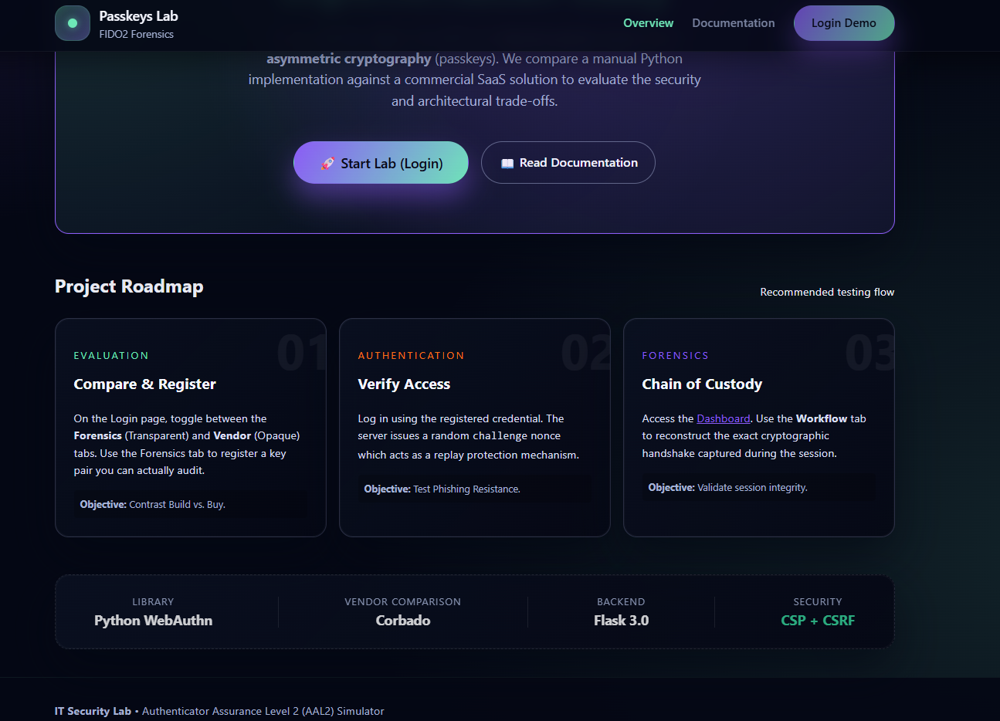
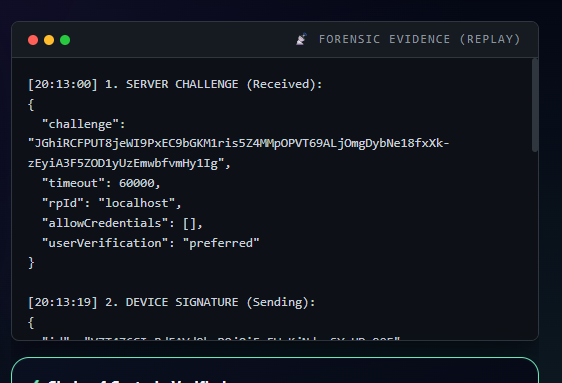
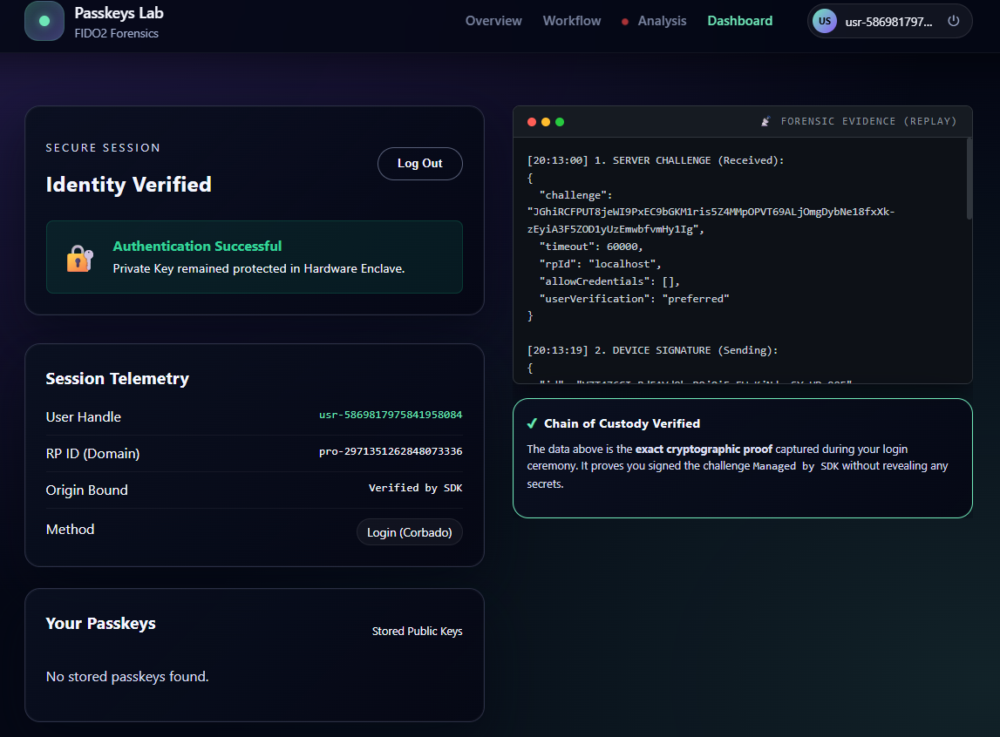

# Passkeys Protocol Auditing Lab

[](https://www.python.org/downloads/)
[](https://flask.palletsprojects.com/)
[](LICENSE)
[](https://github.com/dehlya/passkeys-poc/actions/workflows/webauthn-e2e.yml)
[](https://github.com/dehlya/passkeys-poc/actions/workflows/all-os-smoke.yml)

> **Implementation Study**: Comparing manual WebAuthn/FIDO2 implementation vs. commercial SaaS solutions

*Open source, free to use for any purpose (including commercial). Built for learning, suitable for prototyping.*

An interactive laboratory for analyzing passwordless authentication protocols, built as part of an IT Security course project. This POC demonstrates the shift from shared secrets (passwords) to asymmetric cryptography (passkeys) with transparent protocol visualization.




---

## Project Overview

This project investigates **Authenticator Assurance Level 2 (AAL2)** authentication by implementing:

- **Manual Protocol Mode**: Direct WebAuthn API interaction with full protocol visibility
- **Vendor Comparison Mode**: Integration with Corbado's commercial passkey solution
- **Live Protocol Tracing**: Real-time visualization of cryptographic handshakes
- **Forensic Analysis**: Session replay and chain-of-custody validation



### Key Learning Objectives

1. **Build vs. Buy Trade-offs**: Compare transparency vs. convenience
2. **Security Auditing**: Understand what happens during passkey registration/authentication
3. **Phishing Resistance**: See origin-binding in action
4. **Replay Protection**: Observe challenge-response mechanisms

---

## Quick Start

### Prerequisites

- Python 3.9+
- Node.js 18+ (for Playwright tests)
- Modern browser with WebAuthn support (Chrome, Firefox, Safari, Edge)

### Installation

1. **Clone the repository**

   ```bash
   git clone https://github.com/dehlya/passkeys-poc.git
   cd passkeys-poc
   ```

2. **Set up Python environment**

   ```bash
   cd src
   python -m venv venv
   source venv/bin/activate  # On Windows: venv\Scripts\activate
   pip install -r requirements.txt
   ```

3. **Configure environment variables**

   ```bash
   cp .env.example .env
   # Edit .env with your settings
   # Generate SECRET_KEY: python -c "import secrets; print(secrets.token_hex(32))"
   ```

4. **Run the application**

   ```bash
   python app.py
   ```

5. **Access the lab**

   ```
   Open http://localhost:5000 in your browser
   ```

See [`SETUP_GUIDE.md`](SETUP_GUIDE.md) for detailed instructions.

---

## Project Structure

```
passkeys-poc/
├── README.md                    # This file - project overview
├── LICENSE                      # MIT License
├── SECURITY.md                  # Security policy
├── CONTRIBUTING.md              # Contribution guidelines
├── SETUP_GUIDE.md               # Detailed setup instructions
│
├── .github/
│   └── workflows/
│       ├── e2e.yml              # E2E tests with Playwright
│       └── smoke.yml            # Cross-platform smoke tests
│
├── tests/                       # E2E test suite
│   └── webauthn.spec.js
│
├── src/                         # Main application
    ├── README.md                # App-specific documentation
    ├── app.py                   # Flask application & WebAuthn logic
    ├── config.py                # Configuration management
    ├── requirements.txt         # Python dependencies
    ├── .env.example             # Environment template
    ├── templates/               # HTML templates
    │   ├── base.html
    │   ├── index.html
    │   ├── login.html
    │   ├── protected.html
    │   ├── workflow.html
    │   └── learn.html
    └── static/                  # Frontend assets
        ├── main.css
        └── main.js
 
```

---

## Educational Context

This project was developed as part of the **63-22 IT Security Lab** curriculum to demonstrate:

1. **WebAuthn/FIDO2 Protocol**: Deep dive into W3C standard
2. **Public Key Cryptography**: Practical asymmetric authentication
3. **Security Trade-offs**: Transparency vs. convenience analysis
4. **Threat Modeling**: Phishing resistance, replay attacks, MITM

### Comparison: Build vs. Buy

| Aspect | Manual Implementation | Vendor (Corbado) |
| :--- | :--- | :--- |
| **Transparency** | Full visibility | Black box |
| **Control** | Complete | Limited |
| **Development Time** | ~2-3 weeks | ~2-3 hours |
| **Maintenance** | Your responsibility | Vendor-managed |
| **Audit Trail** | Complete | Partial |
| **Cost** | Development time | Subscription |

---

## Security Features

### Implemented Protections

- **CSRF Protection**: Token-based validation on state-changing endpoints
- **CSP Headers**: Content Security Policy enforcement
- **Challenge Replay Protection**: Single-use nonce verification
- **Origin Binding**: Prevents phishing attacks
- **SQL Injection Prevention**: Parameterized queries throughout
- **Signature Counter**: Detects cloned authenticators
- **Session Security**: HTTPOnly, SameSite cookies

### Security Notes

**This is an educational POC** - Not production-ready. Missing:

- Rate limiting
- Comprehensive logging/monitoring
- Enterprise IAM integration
- HTTPS enforcement (use reverse proxy in production)
- Advanced threat detection

See [`SECURITY.md`](SECURITY.md) for more details.

---

## Testing

This project includes comprehensive automated testing:

### E2E Tests (Playwright)

```bash
# Install test dependencies
npm install

# Run E2E tests
npm run test:e2e
```

Tests cover:
- Full registration flow with virtual authenticator
- Authentication with existing credentials
- Protocol trace visualization
- Protected route access control

### CI/CD Pipeline

Automated tests run on every push:

- **E2E Tests**: Full WebAuthn flows on macOS
- **Cross-Platform**: Smoke tests on Windows, Linux, macOS
- **Multi-Python**: Tests on Python 3.9, 3.11, 3.12

See [`.github/workflows/`](.github/workflows/) for configuration.

---

## Tech Stack

### Backend

- **Flask 3.0**: Web framework
- **py_webauthn 2.0+**: WebAuthn protocol implementation
- **SQLite**: Credential storage
- **Corbado SDK**: Vendor comparison

### Frontend

- **Vanilla JavaScript**: WebAuthn client API
- **CSS3**: Modern styling with design tokens
- **Browser Web Crypto API**: Native cryptography

### Testing

- **Playwright**: End-to-end testing

---

## Demo Scenarios

### Scenario 1: Transparent Audit

- Register with Protocol Auditing mode
- View all cryptographic operations
- Inspect raw protocol payloads

### Scenario 2: Vendor Comparison

- Switch to Corbado tab
- Notice the absence of protocol visibility
- Compare user experience

### Scenario 3: Security Validation

- **Phishing Simulation**: Try accessing via `http://127.0.0.1:5000` instead of `localhost`.
- **Result**: Authentication fails because the passkey is bound to `localhost` (Origin Binding).
- Try replaying old challenge (fails)
- Observe signature counter increments



---

## Contributing

This is an educational project. Contributions welcome for:

- Additional vendor comparisons
- Enhanced testing coverage
- Documentation improvements
- Security hardening suggestions

Please read [`CONTRIBUTING.md`](CONTRIBUTING.md) before submitting PRs.

---

## License

This project is licensed under the MIT License - see the [LICENSE](LICENSE) file for details.

**TL;DR:** Free to use for any purpose, including commercial. Attribution appreciated but not required.

---

## Disclaimer

**FOR EDUCATIONAL AND PROTOTYPING USE**

This is a proof-of-concept implementation designed for learning and demonstration purposes. While it implements real security patterns, it is **NOT intended for production deployment** without significant security hardening, monitoring, and compliance validation.

Use at your own risk. The authors assume no liability for misuse or security vulnerabilities.

---

## Acknowledgments

- **WebAuthn Specification**: W3C & FIDO Alliance
- **py_webauthn Library**: @duo-labs
- **Corbado**: Vendor comparison partner
- **IT Security Lab**: Course instructors and peers

---

## Additional Resources

- [WebAuthn Spec](https://www.w3.org/TR/webauthn/)
- [FIDO Alliance](https://fidoalliance.org/)
- [OWASP Authentication Cheat Sheet](https://cheatsheetseries.owasp.org/cheatsheets/Authentication_Cheat_Sheet.html)
- [Corbado Documentation](https://docs.corbado.com/)

---

## Contact

For questions about this project, please open an issue on GitHub.

**Project Link**: [https://github.com/dehlya/passkeys-poc](https://github.com/dehlya/passkeys-poc)

---

*Built for IT Security education*

